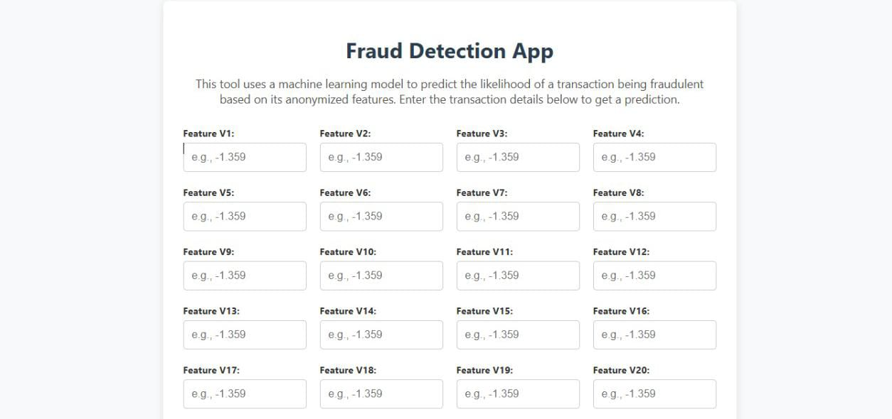
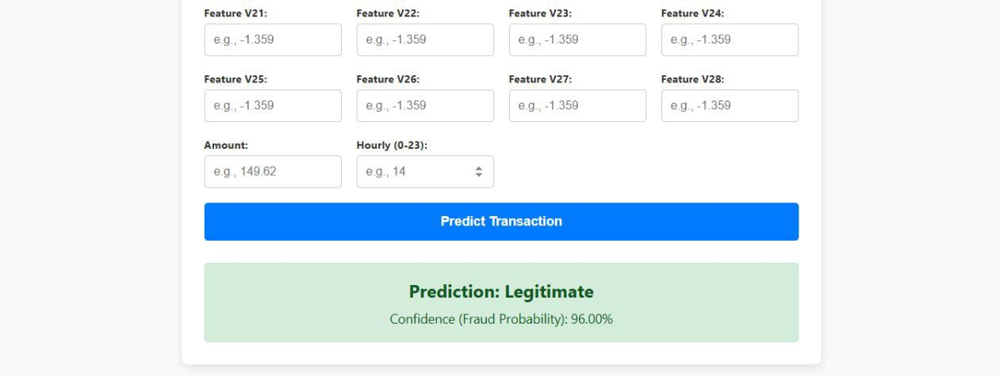

# Credit Card Fraud Detection API

This project is a Django-based web application that serves a machine learning model to detect fraudulent credit card transactions. The model is trained on a highly imbalanced dataset from Kaggle, and this repository contains the full workflow from data analysis in a Jupyter Notebook to a deployed web API.

[](https://www.python.org/downloads/)
[](https://www.djangoproject.com/)
[](https://www.docker.com/)
[](https://opensource.org/licenses/MIT)

## Project Overview

The primary goal is to build a reliable classifier to distinguish between legitimate and fraudulent transactions. The project tackles the core challenge of extreme class imbalance using techniques like SMOTE and evaluates models using appropriate metrics like Average Precision.

## Project Demo / Screenshots

Below is a screenshot of the main user interface for the Fraud Detection App. Users can input the 30 required transaction features (`V1`-`V28`, `Amount`, and `Hourly`) into the form. Upon submission, the model returns a prediction of "Legitimate" or "Fraudulent" along with a confidence score indicating the probability of fraud.




### Features
* **Exploratory Data Analysis (EDA)** to understand data distributions and class imbalance.
* **Feature Engineering** to create more predictive features from existing data (`Amount_log`, `Hourly`).
* **Baseline Model** (Logistic Regression) to establish an initial performance benchmark.
* **Advanced Model** (SMOTE + Random Forest) for superior performance on the imbalanced data.
* **Django API** to serve the trained model and provide real-time predictions via a web interface.
* **Docker Support** for easy setup and deployment using containers.

## Dataset

The project uses the "Credit Card Fraud Detection" dataset from Kaggle.
* **Source:** [Kaggle Dataset Link](https://www.kaggle.com/datasets/mlg-ulb/creditcardfraud)
* **Description:** The dataset contains transactions made by European cardholders. It presents a total of 284,807 transactions, of which only 492 (0.172%) are fraudulent. The features `V1` to `V28` are the result of a PCA transformation to protect user identity.

## Project Structure

```
Fraud_detection_django_app/
│
├── images/      # csv file
│   ├── dashboard3.jpg
│   └── dashboard4.jpg
│
├── data/      # csv file
│   └── creditcard.csv
│
├── fraud_detection/      # Django Project Directory
│   ├── manage.py
│   ├── fraud_detection/  # Project settings
│   ├── fraud_app/        # Django App
│   │   ├── templates/
│   │   │   └── fraud_app/
│   │   │       └── predict.html
│   │   ├── migrations/
│   │   ├── urls.py
│   │   └── views.py
│   └── ml_models/
│       ├── fraud_detection_smote_rf.pkl # RandomForest model
│       └── fraud_detection_pipe.pkl  # Logistic Model
│
├── fraud.ipynb           # Jupyter Notebook for EDA and Model Training
├── myenv/                  # Virtual Environment
├── .gitignore
├── .gitattributes
├── .dokerignore
├── LICENCE
├── Dockerfile
├── docker-compose.yml
├── requirements.txt
└── README.md
```

## Running the Application (Choose One Method)

### Method 1: Running with Docker (Recommended) 🐳

This method uses Docker and Docker Compose to build and run the application in an isolated container.

**Prerequisites:**
* Docker Desktop installed and running.

**Steps:**
1.  **Clone the Repository:**
    ```bash
    git clone https://github.com/kanyi-Gabriel/fraud_detection_django_app.git
    cd fraud_detection
    ```
2.  **Place the Model File:** Ensure your preferred trained model (`.pkl` file, e.g., `fraud_detection_smote_rf.pkl`) is inside `card_fraud/fraud_detection/ml_models/`. **Important:** Make sure the `model_path` variable in `fraud_app/views.py` points to the correct `.pkl` file you want to use.
3.  **Build and Run with Docker Compose:**
    ```bash
    docker-compose up --build
    ```
    *(The `--build` flag is only needed the first time or if you change `Dockerfile` or `requirements.txt`)*

The application will be accessible at `http://localhost:8000/`. Press `Ctrl+C` in the terminal to stop the container.

---
### Method 2: Running Locally with Virtual Environment

This method runs the application directly on your machine using a Python virtual environment.

**Prerequisites:**
* Python 3.12+ installed.

**Steps:**
1.  **Clone the Repository:**
    ```bash
    git clone https://github.com/kanyi-Gabriel/fraud_detection_django_app.git
    cd fraud_detection
    ```
2.  **Create and Activate Virtual Environment:**
    ```bash
    python3 -m venv myenv
    source myenv/bin/activate
    ```
    *(On Windows: `myenv\Scripts\activate`)*
3.  **Install Dependencies:**
    ```bash
    pip install -r requirements.txt
    ```
4.  **Place the Model File:** Ensure your preferred trained model (`.pkl` file) is inside `card_fraud/fraud_detection/ml_models/` and that `fraud_app/views.py` points to it.
5.  **Run the Django Server:**
    ```bash
    cd fraud_detection/
    python3 manage.py runserver
    ```

The application will be accessible at `http://127.0.0.1:8000/`.

## Model Performance

| Model                               | Evaluation Metric     | CV Score (Avg Precision) |
| ----------------------------------- | --------------------- | ------------------------ |
| Logistic Regression (Baseline)      | Average Precision     | ~0.713                   |
| **SMOTE + Random Forest (Advanced)** | **Average Precision** | **~0.845** |

**Recommendation:** Use the **SMOTE + Random Forest** model (`fraud_detection_smote_rf.pkl` if trained and saved) for better prediction accuracy and more meaningful confidence scores.

